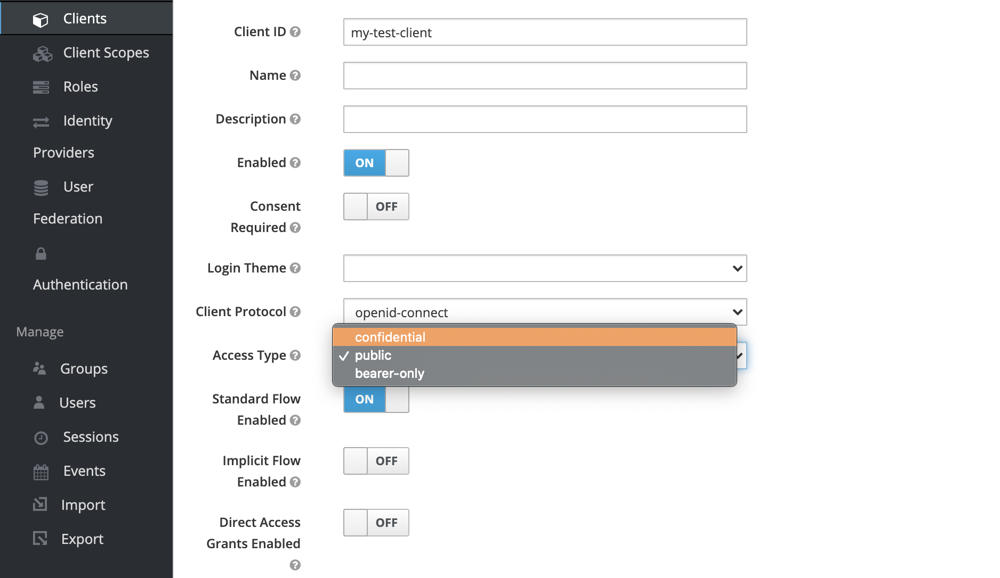
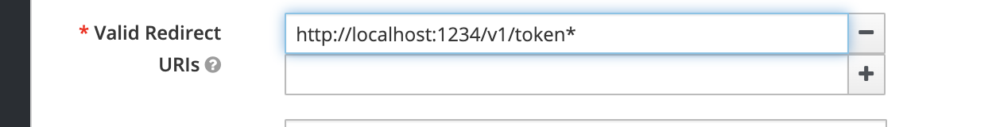
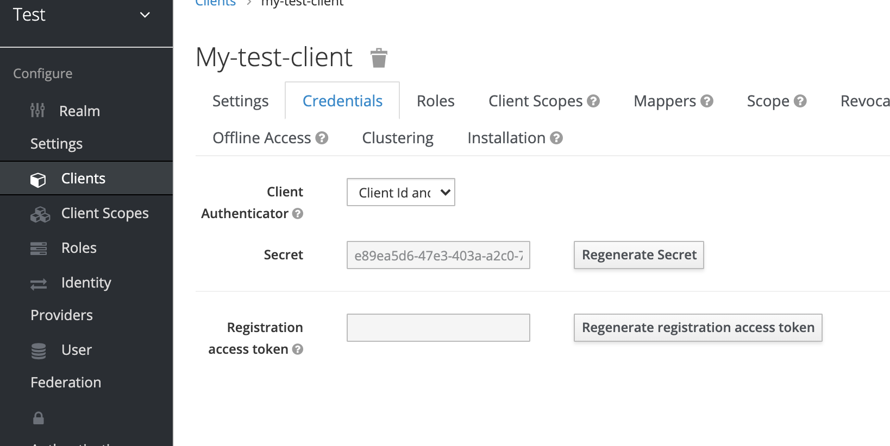
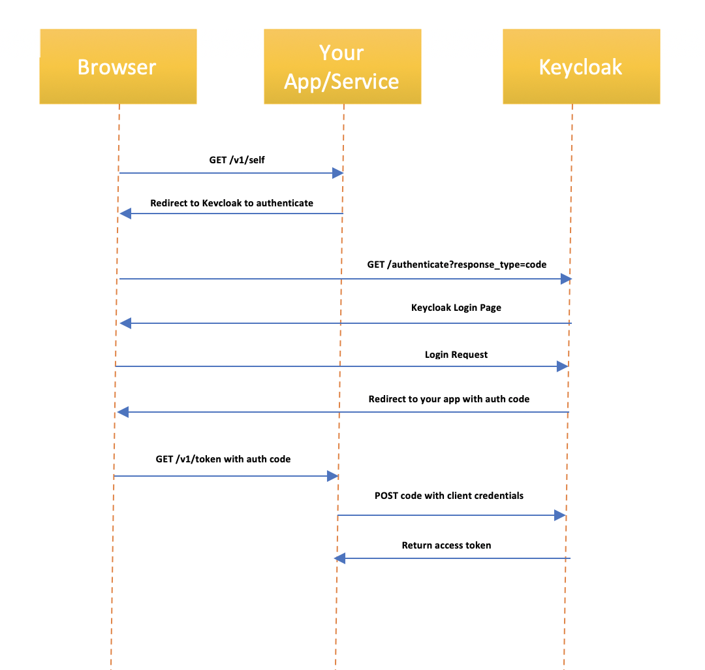

# Token Flows

In the previous section, we utilized `curl` to perfrom HTTP requests to get the token. This was possible through something called a [Direct Access Grant](https://oauth.net/2/grant-types/password/) and usually, in a web application or a service, we don't want that since this involves sending plaintext username and password in a request. 

The most recommended way of getting a token for your application or service is through something called Authorization Code Flow.

## Authorization Code Flow

First, you need to fire up the Keycloak Administration Console again and change some configuration parameters on the `client` we created:

1. Disable Direct Access Grant
2. Change the `Access Type` to `confidential`
3. For `Valid Redirect URIs` specify the URL of the REST API we've implemented so far with a new path that we're going to implement now




Click on `save`. Once this is done, a new tab appears on the client called `Credentials`. Click on it and copy the value of `Secret`. 



The `Client Id` and the `Client Secret` are a pair of credentials that an app or a service can use to authenticate itself. A client entity itself is a specification representing an app or a service wishing to utilize the authentication capabilities exposed by Keycloak. 

Once this configuration is done, a token can be generated by opening this URL in the browser:

```
http://localhost:8080/auth/realms/test/protocol/openid-connect/auth?response_type=code&client_id=my-test-client&redirect_uri=http%3A%2F%2Flocalhost%3A1234%2Fv1%2Ftoken&scope=openid&state=something
```
This is a URL for keycloak with some query parameters defining what type of engagement we're about the begin. When you open this URL, you'll be redirected to a login page. Put in the credentials that we've used so far and login. Once you've logged in, you're redirected to a non-existent URL. This is fine, we're going to build the API on this URL later on. For now, focus on the URL itself which should be of the following form:

```
http://localhost:1234/v1/token?state=http%3A%2F%2Flocalhost%3A1234%2Fv1%2Fself&session_state=01235309-3305-44d2-afb3-6fcda5ead626&code=1debba47-218a-46e0-b973-f514ccf03b85.01235309-3305-44d2-afb3-6fcda5ead626.8ed9bbce-6bfd-469a-adbd-f6ed30293de9
```

Notice the value of `code` query parameter. Copy it. We now need to perform a `POST` request using `curl` with this `code` and the client credentials we set up earlier as follows:

```
curl -X POST http://localhost:8080/auth/realms/test/protocol/openid-connect/token \
--data grant_type=authorization_code \
--data 'client_id=my-test-client' \
--data client_secret=<PUT CLIENT SECRET HERE> \
--data code=<PUT CODE HERE> \
--data 'redirect_uri=http%3A%2F%2Flocalhost%3A1234%2Fv1%2Ftoken'
```

In response, you'd get the same payload as before with `access_token` in it. 

Okay, so what just happened? The exchange of requests above is supposed to be done by your app or service in an automated way as follows:



1. You open a browser and perform a `GET` call to your service
2. Your service redirects your browser to keycloak so that it can get an authorization code. Your browser then perfroms a `GET` on keycloak
3. Keycloak establishes that you're not logged in and returns a login page
4. Once you login, keycloak redirects your browser back to the service with authorization code. Your browser performs a new `GET` call on your service with the authorization code
5. Combining the authorization code with client credentials, your service performs a `POST` call. This establishes the identity of your service and returns an access token

This is the standard [OAuth2 Authorization Code Flow](https://oauth.net/2/grant-types/authorization-code/) which a lot of modern apps and services use for different purposes. For example, wherever you see the button `Login with Google` or `Login with Facebook`, you're essentially using this flow where `Google` and `Facebook` are acting as the servers that provide authorization services like Keycloak. 

To programatically demonstrate this, let's modify our REST API to cater for redirection as follows:

```
import falcon
from openidcpy import OidcClient
from json import dumps
import bjoern
import uuid

discovery_url = 'http://localhost:8080/auth/realms/test/.well-known/openid-configuration'
client_id = 'my-test-client'
# We'd need to include the client secret too now
client_secret = 'e89ea5d6-47e3-403a-a2c0-724445c6699e'
client = OidcClient(discovery_uri=discovery_url, client_id=client_id,
                    client_secret=client_secret)


# Applications implementing authorization code flow
# usually require sessions, we're going to store 
# sessions here
SESSIONS = {}


# Just a random session id generator
get_new_id = lambda: str(uuid.uuid1())


def get_user(claims):
  user = {'id': claims['sub']}
  if 'email' in claims:
    user['email'] = claims['email']
  if 'given_name' in claims:
    user['firstname'] = claims['given_name']
  if 'family_name' in claims:
    user['lastname'] = claims['family_name']
  if 'preferred_username' in claims:
    user['username'] = claims['preferred_username']
  return user


class SelfApi(object):

  def on_get(self, req, resp):
    # We'd be checking if the URL has a query parameter
    # named cookie. If not, we need to initialize the 
    # Authorization Code flow
    if 'cookie' not in req.params or req.params['cookie'] not in SESSIONS:
      # Notice how we've used state here
      auth_url = client.create_auth_url('code',
                                        'http://localhost:1234/v1/token',
                                        ['openid'],
                                        'http://localhost:1234/v1/self')
      raise falcon.HTTPFound(auth_url)
    try:
      # If the cookie is found, we should have a respective
      # session state object in our SESSIONS. Based on our
      # implementation, this should contain the token
      token = SESSIONS[req.params['cookie']]['access_token']
      claims = client.validate_jwt(token, options={'verify_aud': False})
      resp.body = dumps(get_user(claims))
      resp.status = falcon.HTTP_200
    except Exception as e:
      raise falcon.HTTPUnauthorized('Unauthorized', e.args[0])

# We're going to implement a new endpoint that is going
# to handle the redirect from keycloak to our REST API
# and exchange code for token
class TokenApi(object):

  def on_get(self, req, resp):
    if 'code' in req.params and 'state' in req.params:
      try:
        token = client.get_tokens_from_code(req.url,
                                            'http://localhost:1234/v1/token',
                                            ['openid'], req.params['state'])
        # Once we have the token, we need to generate a 
        # new identifier, save this token in SESSIONS
        # against that identifier
        session_id = get_new_id()
        SESSIONS[session_id] = token
      except Exception as e:
        resp.body = dumps({'error', e.args[0]})
        resp.status = falcon.HTTP_500
      # Finally, we're going to give the identifier to 
      # the browser as a query parameter
      # NOTE: We're doing this only for demonstration 
      # purposes. Do not do this in production. 
      # Production apps should use 
      # IndexDB or sessionStorage
      raise falcon.HTTPFound(req.params['state'] + '?cookie=' + session_id)
    else:
      raise falcon.HTTPBadRequest('CodeNotFound',
                                  'The server did not return an authorization code')


if __name__ == '__main__':
  api = falcon.API()
  api.add_route('/v1/self', SelfApi())
  api.add_route('/v1/token', TokenApi())
  bjoern.run(api, '0.0.0.0', 1234)

```

Pasting this code in a file and running it will expose this endpoint on http://localhost:1234/v1/self. Open this URL in a browser. You'll instantly be redirected to a login page on Keycloak. Once you login, you'd be redirected back to the REST API which would accept your request now. 

## Refresh Token Flow

As I specified before, tokens come with an expiration date after which they're not valid, so if a token expires, you'd have to get a new token. Getting a new token through Authorization Code flow is disruptive in the sense that it requires a number of redirects through browser and occasionally, it would require a user action i.e. it would want the user to log-in again on Keycloak because keycloak's login session also expires. 

To avoid disruption, the payload that contains the `access_token` also comes with another token which is specified against `refresh_token`. Usually, the expiration of a`refresh_token` is more than `access_token`, so even if an `access_token` expires, `refresh_token` might still be valid. 

We can use the refresh token to generate a new access token by doing the a `POST` request. Copy the value of `refresh_token` and do the `POST` using the curl as follows:

```
curl -X POST http://localhost:8080/auth/realms/test/protocol/openid-connect/token \
--data grant_type=refresh_token \
--data 'client_id=my-test-client' \
--data client_secret=<PUT CLIENT SECRET HERE> \
--data refresh_token=<PUT REFRESH TOKEN HERE>
```

Programatically, you'd need to change the `SelfApi` handler as follows:

```
from jwt import ExpiredSignatureError
import requests


class SelfApi(object):

  def on_get(self, req, resp):
    if 'cookie' not in req.params or req.params['cookie'] not in SESSIONS:
      auth_url = client.create_auth_url('code',
                                        'http://localhost:1234/v1/token',
                                        ['openid'],
                                        'http://localhost:1234/v1/self')
      raise falcon.HTTPFound(auth_url)
    try:
      self.create_self(req, resp)
    # This exception tells that the token has expired
    except ExpiredSignatureError:
      data = {
        'grant_type': 'refresh_token',
        'client_id': client_id,
        'client_secret': client_secret,
        'refresh_token': SESSIONS[req.params['cookie']]['refresh_token']
      }
      # We need to perform a POST on the token endpoint
      with requests.post(
          'http://localhost:8080/auth/realms/test/protocol/openid-connect/token',
          data=data) as resp:
        if resp.status_code == 200:
          SESSIONS[req.params['cookie']] = resp.json()
          self.create_self(req, resp)
        else:
          raise falcon.HTTPInternalServerError('Unknown error occurred')
    except Exception as e:
      raise falcon.HTTPUnauthorized('Unauthorized', e.args[0])

  # We've factored out this code since it's used twice
  def create_self(self, req, resp):
    token = SESSIONS[req.params['cookie']]['access_token']
    claims = client.validate_jwt(token, options={'verify_aud': False})
    resp.body = dumps(get_user(claims))
    resp.status = falcon.HTTP_200
```