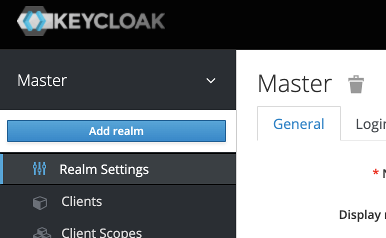

# Levels of access control through Keycloak

A few years ago when I was introduced to the world of microservices for the purpose of looking into token authentication, I stumbled across Keycloak. Keycloak is an open-source identity and access management service maintained by JBoss, a division of Red Hat. Keycloak comes with a plethora of features that do take some time to get familiar with. Some of these features, such as OpenID Connect, RBAC, and Authorization services are very useful for the security needs of modern microservices. This 4-part series is for those who want to rapidly ramp-up their know-how of these crucial features. We'd be covering token based authentication, authorization flow, access control, and authorization services through Keycloak with example use cases. I'm going to use python for rapid prototypes and proof of concepts. 

## The Setup

You'd need a running keycloak instance. The easiest way to bring it up is by running its docker container. To do so, first [install docker](https://docs.docker.com/engine/install/) and then run the following:

```
docker run -d -p 8080:8080 -e KEYCLOAK_USER=admin -e KEYCLOAK_PASSWORD=password --name keycloak jboss/keycloak:10.0.2
```

This runs the Keycloak version 10.0.2 in a docker container and binds it to port 8080 of your machine. Once the keycloak service has fully booted up, it will be available at http://localhost:8080/auth/. Open up this URL in a browser and you'd see the keycloak homepage. Click on `Administration Console` and use the following credentials to log in:

```
Username: admin
Password: password
```

We specified these credentials above as environment variables to the docker container when we ran it. Once you log in, you're redirected to the realm administration console. A realm is like a context, a tenancy, or a container. It can represent an organization and any user, groups, or roles related to an organization can reside in a realm. A better way to explain it would be to say that normally, one realm must have users with unique usernames but two users with the same username can exist in different realms. They would be two different users. When you login with the credentials above, you're redirected to the administration console of the `master` realm. This is the central realm that manages all the other realms. You can create a new realm by hovering on the `Master` in the navigation panel on the left and click on `Add Realm`



I'll be working on a new realm called `test`.

Keycloak stores its configuration data in a JDBC supported database and when no external database is specified, runs with an embedded H2 instance which is sufficient for our use case. The H2 database is destroyed when the keycloak docker container is deleted. 

## Guides

* **[Token Based Authentication](token-auth.md)**
* **[Token Flows](flows.md)**
* **[Access Control Through Roles and Tokens](rbac.md)**