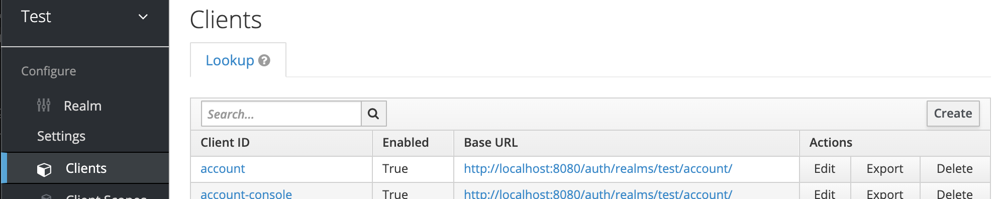
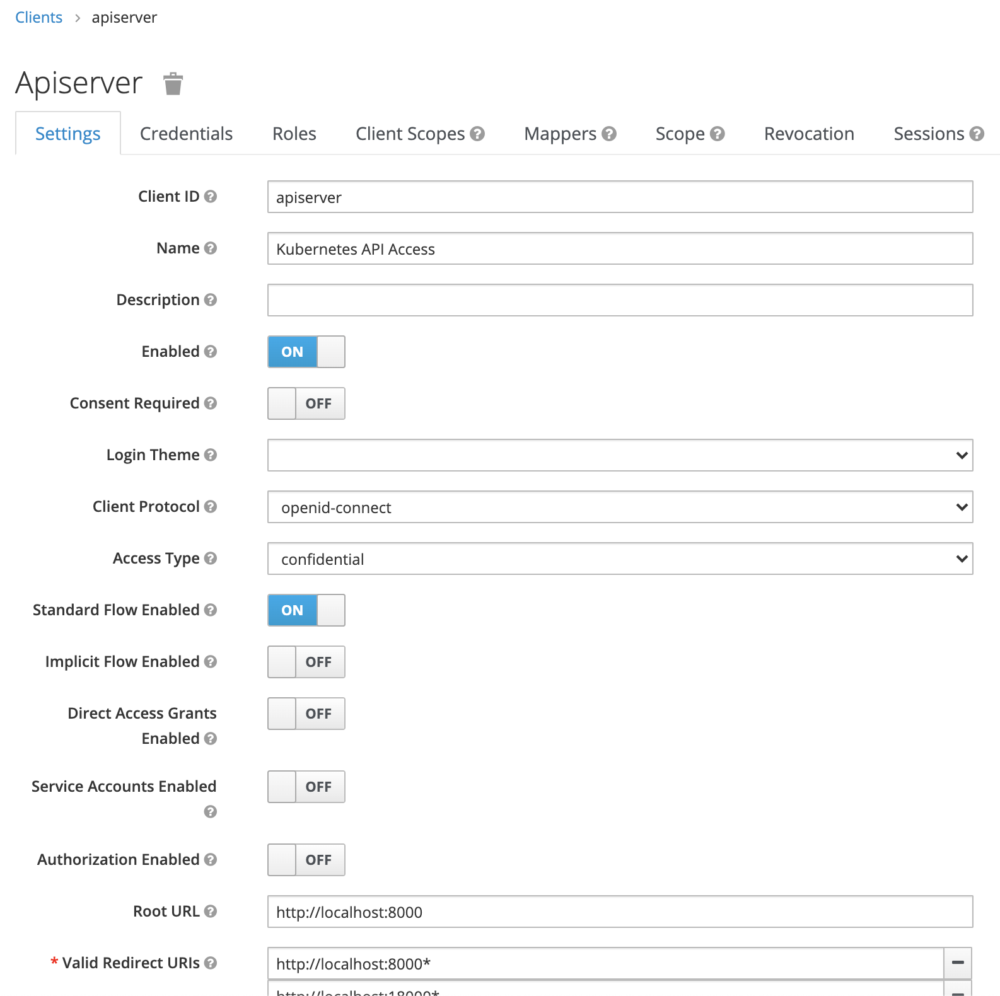
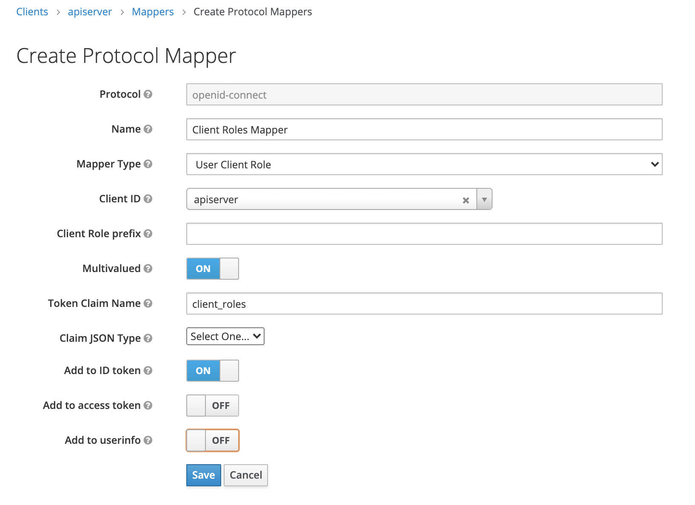
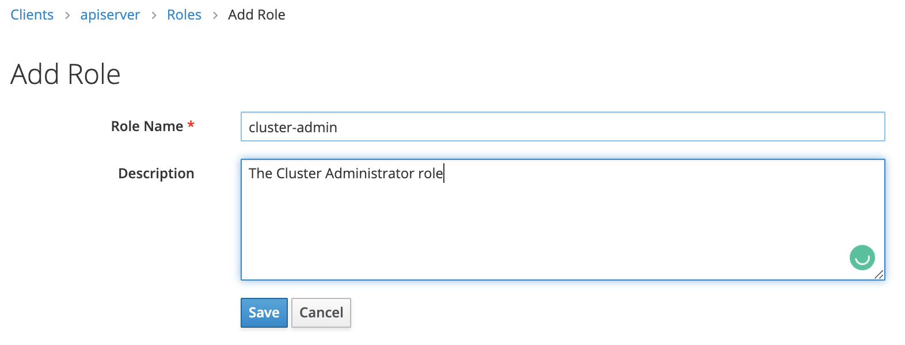
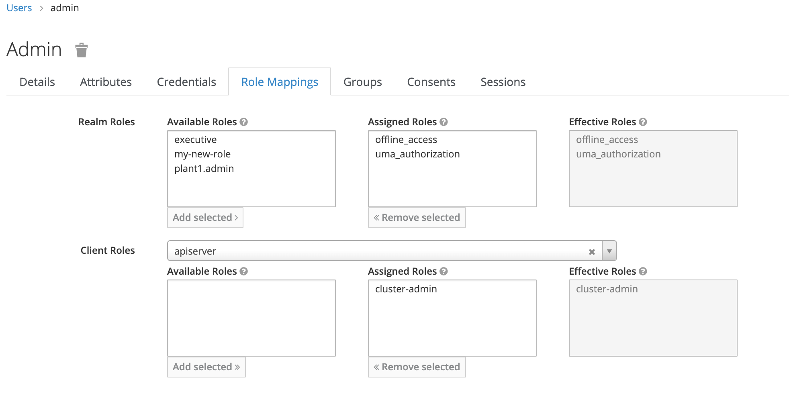

# Access Control Through Roles and Tokens - Kubernetes Integration

There are a bunch of open source software that provide out of the box integration with OpenID Connect providers such as Keycloak. Additionally, some of them provide the ability to bring in groups/roles from the tokens which are then used for limiting access of users. One such widely used tool is Kubernetes. This guide details the integration of Kubernetes with Keycloak for authentication and access control. We can utilize Kubernetes [support for OpenID Connect Tokens](https://kubernetes.io/docs/reference/access-authn-authz/authentication/#openid-connect-tokens) with `oidc-groups-prefix` to integrate with keycloak. 


## Keycloak Configuration

At the end of Keycloak, we need to create a new client for Kubernetes. To do so, log-in to the Keycloak Administration Console, click on `Clients` in the navigation, and click on `Create`:



Let's name our client [apiserver](https://kubernetes.io/docs/reference/command-line-tools-reference/kube-apiserver/) after the name of the actual service that handles all the authentication. This client needs to be confidential with only `Standard Flow` enabled. For `Valid Redirect URLs`, use `http://localhost:8000*` and `http://localhost:18000*`



Click on save to create the new client. Once the client is saved, click on `Credentials`, copy the value of `Secret` and save it somewhere. We're going to use it later on. 

Click on `Mappers` and then `Create` to initiate the view for new mapper definition. 

For the new mapper, the `Mapper Type` needs to be `User Client Role`. Once you select this type, the view changes. The `Client ID` should be `apiserver` i.e. the name of the client we created. Since it's multivalued, we need to set `Multivalued` to `ON`. The `Token Claim Name` is the name of the property in the token payload against which the roles are added. I've set it to `client_roles`. Kubenetes utilizes ID Tokens so we need to add these claims to the ID Token by setting `Add to ID Token` to `ON`:



Click on `Save`. Note that due to a bug in Keycloak, I haven't configured the `Claim JSON Type`. If I set it to something, the roles don't appear in the token.

Now navigate back to the configuration view for `apiserver` client and click on `Roles`. In here we can define the roles that are specific to this client. Click on `Add Role` to create new role. Let's name our new role `cluster-admin` akin to the `cluster-admin` `ClusterRole` defined in Kubernetes. We'd also be mapping it to the same role.



Let's also assign it to our `admin` user that we created in one of the previous guides. To do so, click on `Users` in the navigation, search for the `admin` user, click on its `ID` to open its configuration view. Now Click on `Role Mappings`. In the `Client Roles` list box, select `apiserver`. In the `Available Roles` list that appears after selecting `apiserver`, click on `cluster-admin` role that we just created and then assign it to `admin` user by clicking on `Add selected`:




## Creation of ClusterRoleBinding

Inside Kubernetes, you need to create a `ClusterRoleBinding` object as follows:

```
apiVersion: rbac.authorization.k8s.io/v1
kind: ClusterRoleBinding
metadata:
  name: oidc-cluster-admin
roleRef:
  apiGroup: rbac.authorization.k8s.io
  kind: ClusterRole
  name: cluster-admin
subjects:
- apiGroup: rbac.authorization.k8s.io
  kind: Group
  name: oidc:cluster-admin
```
Here, we're using the `cluster-admin` role coming from Keycloak inside the token as a Kubernetes `Group` and we're assigning it the `cluster-admin` `ClusterRole`. 

If you have [kubectl installed](https://kubernetes.io/docs/tasks/tools/install-kubectl/), you can save this to a file called `oidc-cluster-admin.yaml` and do:

```
kubectl apply -f oidc-cluster-admin.yaml
```


## Apiserver Configuration

Kubernetes is not a single service or an app. It's a bunch of services that are run together. These services communicate with each other to achieve the features of Kubernetes. Normally, these services are classified as part of either the control plane of kubernetes or worker nodes, where the worker nodes host the actual workloads while the control plane manages these worker nodes. One such service that is part of the control plane is `kube-apiserver`. Whenever a user tries to interact with a Kubernetes, they do so by communicating with `kube-apiserver` over a [REST API](https://kubernetes.io/docs/reference/). So naturally, this is the component that handles authentication and access control. To allow this integration, we'd need to do some configuration changes to this component. 

For this, we need to locate the `kube-apiserver` process whic is usually run inside a container and figure out how it's being run. Usually, `kube-apiserver` container is deployed as a [static pod](https://kubernetes.io/docs/tasks/configure-pod-container/static-pod/) or a systemd service. For example, [kubespray](https://github.com/kubernetes-sigs/kubespray) usually deploys it as a static pod by creating a manifest in `/etc/kubernetes/manifests` by the name of `kube-apiserver.yaml`. 

These configuration changes are done to the command-line parameters of the `kube-apiserver` executable. Specifically, we need to add/update the following parameters:

* `--oidc-client-id`: Set it to `apiserver`
* `--oidc-groups-claim`: Set it to `client_roles` or whater value you set against the `Token Claim Name` when you configured the mapper
* `--oidc-issuer-url`: This can be figured out from the token payload. It's the value of the `iss` claim. For our locally running keycloak, this should be `http://localhost:8080/auth/realms/system`
* `--oidc-username-claim`: The claim against which the username of the logged-in user is given. In one of the previous guides, we figured out that it's given against `preferred_username`
* `--oidc-username-prefix`: Optional, but good practice so that the usernames that come from Keycloak do not conflate with the existing users. Set it to `oidc:`
* `--oidc-groups-prefix`: Again, optional, but good practice for the same reasons. Set it to `oidc:`

Once these parameters are configured, restart the `kube-apiserver` container. 

## Kubectl configuration

`kubectl` is the CLI tool to administer a kubernetes cluster. You need to have [kubectl installed](https://kubernetes.io/docs/tasks/tools/install-kubectl/) for this. Inherently, it does not support OpenID Connect Token Authentication, but there's a plugin called [kubelogin](https://github.com/int128/kubelogin) that we can use to add its support so go ahead and [install this plugin too](https://github.com/int128/kubelogin#setup). 

Once the plugin is installed do the following steps:

1. Configure new credentials through kubectl using kubelogin plugin:


```
kubectl config set-credentials oidc --exec-api-version=client.authentication.k8s.io/v1beta1 \
          --exec-command=kubectl \
          --exec-arg=oidc-login \
          --exec-arg=get-token \
          --exec-arg=--oidc-issuer-url=http://localhost:8080/auth/realms/test \
          --exec-arg=--oidc-client-id=apiserver \
          --exec-arg=--oidc-client-secret=<PUT CLIENT SECRET HERE>
```

The value of `--oidc-issuer-url` need to be the value against the `iss` claim in the token, while the value of `--oidc-client-secret` needs to be the `Secret` we saved before when we were creating the client in Keycloak. 

2. Create a new cluster through the following command:


```
kubectl config set-cluster my-kubernetes --server https://<PUT KUBERNETES CLUSTER HOSTNAME OR IP HERE>:6443 --certificate-authority=/path/to/ca.crt/file
```

The value of `--server` needs to be a hostname or IP address on which `kube-apiserver` is bound and listening for requests. Usually it's the IP address of one of the nodes in the control plane. The value of `--certificate-authority` is path to the CA certificate that this kubernetes cluster is using to secure its communication. if you don't have this certificate, you can specify `--insecure-skip-tls-verify=true` instead of a `--certificate-authority` parameter but that's not recommended since it exposes your communication to interception. 

3. Create a new context through the following command:

```
kubectl config set-context my-cluster-context --cluster=my-kubernetes --user=oidc
```

4. Set it to the current context:

```
kubectl config use-context my-cluster-context
```

And that's it. Our configuration changes are done.

## Testing

Run any `kubectl` command:

```
kubectl cluster-info
```

This is going to open a login page on keycloak. Use the `admin` credentials to log-in. Previously, we assigned the this user the `cluster-admin` client role which we then mapped to `cluster-admin` `ClusterRole` through a `ClusterRoleBinding` so `admin` should have full access to the cluster. 