# Access Control Through Roles and Tokens

In one of the [previous guides](token-auth.md), we covered how tokens generated by Keycloak have some very specific pieces of information (claims) due to it's support for [OpenID Connect](https://openid.net/specs/openid-connect-core-1_0.html#IDToken). However, the token also contains some non-standard claims, such as `preferred_username`. Let's generate a token, examine it and see what else is in there. Use one of the methods discussed in the previous guides to generate a token. I'm just going to put a decoded token in here:

```
{
    "exp": 1596517043,
    "iat": 1596481043,
    "jti": "24690fd3-bf00-450f-8937-1893cea8bf8a",
    "iss": "http://localhost:8080/auth/realms/test",
    "aud": "account",
    "sub": "f33d74d4-a5ed-4da0-817c-503e75a81465",
    "typ": "Bearer",
    "azp": "my-test-client",
    "session_state": "f8530352-29b3-47f0-bfb5-914bc8b6536e",
    "acr": "1",
    "allowed-origins": [
        "/*"
    ],
    "realm_access": {
        "roles": [
            "offline_access",
            "uma_authorization"
        ]
    },
    "resource_access": {
        "account": {
            "roles": [
                "manage-account",
                "manage-account-links",
                "view-profile"
            ]
        }
    },
    "scope": "email profile",
    "email_verified": false,
    "preferred_username": "admin"
}
```

One of the very first thing to observe is the `realm_access` claim. In the value, you can see the actual roles assigned to the user `admin`. Let's create a new role, assign it to this user and regenerate the token. To create a new role, log-in to the Keycloak Administration Console, click on `Roles` from the navigation and then click on `Add Role`:
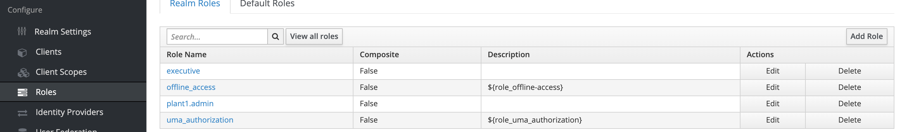

For the new role, you just need to provide the `Role Name`. I'm naming it `my-new-role`:
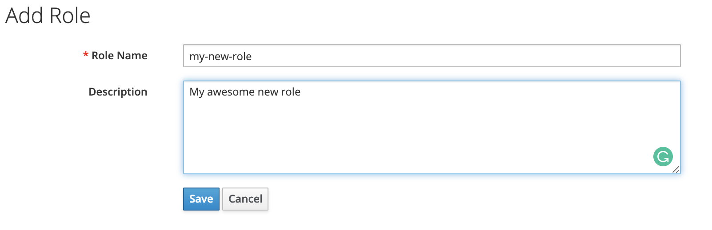

Now let's navigate to `Users`, search for `admin`, open it, click on `Role Mappings`. From there, select the new role we created i.e `my-new-role`, and click on `Add Selected`. 

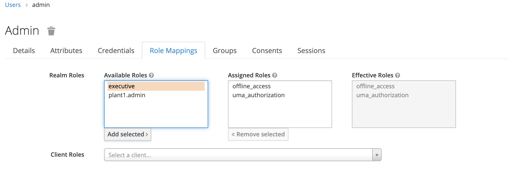

Regenerate the token through one of the methods in the previous guides and inspect it's payload: 

```
{
  "exp": 1596777325,
  "iat": 1596741325,
  "jti": "241d782b-f701-435d-b107-274662950bd0",
  "iss": "http://localhost:8080/auth/realms/test",
  "aud": "account",
  "sub": "f33d74d4-a5ed-4da0-817c-503e75a81465",
  "typ": "Bearer",
  "azp": "my-test-client",
  "session_state": "d8ac57d1-6909-4fa1-81fb-a9368418a87e",
  "acr": "1",
  "allowed-origins": [
    "http://localhost"
  ],
  "realm_access": {
    "roles": [
      "my-new-role",
      "offline_access",
      "uma_authorization"
    ]
  },
  "resource_access": {
    "account": {
      "roles": [
        "manage-account",
        "manage-account-links",
        "view-profile"
      ]
    }
  },
  "scope": "email profile",
  "email_verified": false,
  "preferred_username": "admin"
}
```

The `realm_access` claim would contain the new role we created. Similarly consider the `resource_access` claim. It contains the client roles assigned to the user `admin`. A client role is a role that is only relevant to a client in Keycloak. They can be viewed in the Administration Console by opening the client configuration and clicking on `Roles`:

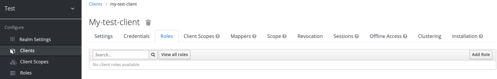

Click on `Add Role` to define a new role for this client. Like before, a role only requires a name:

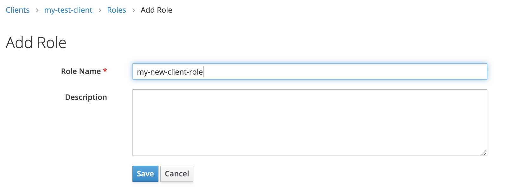

Now, we assign this role to the user `admin` in a similar fashion. Navigate to users, open up `admin`, click on `Role Mappings`, in the drop-down against `Client Roles`, search for the client in which we created the role by typing `my-test-client`. It should appear in the list. Select it. Another roles list appears, select our newly created role from that list and click on `Add Selected`:

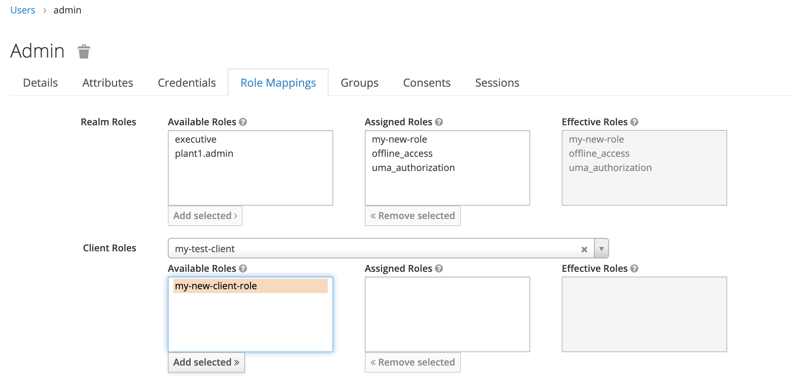

Regenerate the token through one of the methods in the previous guides and inspect it's payload: 

```
{
  "exp": 1596778012,
  "iat": 1596742012,
  "jti": "04b7a32a-a15a-45dc-95ef-4c47cbc23746",
  "iss": "http://localhost:8080/auth/realms/test",
  "aud": "account",
  "sub": "f33d74d4-a5ed-4da0-817c-503e75a81465",
  "typ": "Bearer",
  "azp": "my-test-client",
  "session_state": "ae62d1f2-2315-4c58-9cec-1337421b592d",
  "acr": "1",
  "allowed-origins": [
    "http://localhost"
  ],
  "realm_access": {
    "roles": [
      "my-new-role",
      "offline_access",
      "uma_authorization"
    ]
  },
  "resource_access": {
    "my-test-client": {
      "roles": [
        "my-new-client-role"
      ]
    },
    "account": {
      "roles": [
        "manage-account",
        "manage-account-links",
        "view-profile"
      ]
    }
  },
  "scope": "email profile",
  "email_verified": false,
  "preferred_username": "admin"
}
```

As you can see, the newly created client role appears in `resource_access` claim against the client name. 

You get the same token in your service or app, and if you want, you can leverage this information to restrict access to an API to certain role(s). Let's do this in our original example of the `/v1/self` API. We'd have to modify the `SelfApi` `on_get` function as follows:


```
class SelfApi(object):

  def on_get(self, req, resp):
    if req.auth is None:
      raise falcon.HTTPUnauthorized('Unauthorized', 'Bearer token not provided')
    try:
      token = req.auth.split(' ')[1]
      claims = client.validate_jwt(token, options={'verify_aud': False})
      # We check for the presence of roles in the realm_access
      # claims
      if 'my-new-role' in claims['realm_access']['roles']:
        resp.body = dumps(get_user(claims))
        resp.status = falcon.HTTP_200
        return
      # if the role isn't present, we need ro return 403
      raise falcon.HTTPForbidden('Forbidden', 'User does not have the required role')
    except falcon.HTTPForbidden:
      raise
    except Exception as e:
      raise falcon.HTTPUnauthorized('Unauthorized', e.args[0])
```

Modify our original example code as above and run it. Generate a new token through `admin` and do a `GET` through `curl` like below:

```
curl -H "Authorization: Bearer <TOKEN>" http://localhost:1234/v1/self
```

This would yield:

```
{
    "id": "f33d74d4-a5ed-4da0-817c-503e75a81465",
    "username": "admin"
}
```

Now remove the role from the user `admin` by going into `Role Mappings`, selecting `my-new-role` from the `Assigned Roles` and clicking on `Remove Selected`. Regenerate the token and perform the above `GET` request again. You'd get:

```
{
    "title": "Forbidden",
    "description": "User does not have the required role"
}
```

You can similarly pull this off using client roles specified in `resource_access` too. 

There are certain scenarios in which you might want additional information in the token e.g. groups assignment or you might want the roles but against another key instead of `realm_access`. Fortunately, Keycloak lets you do that. For example, if you want to add the groups that a user is part of to the token, open up the client against with the token is generated from the Administration Console and click on Mappers:

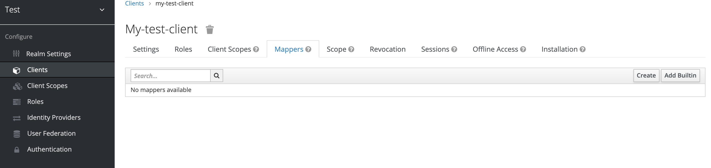

A mappers is a configuration that maps a piece of information to a key or property in the token. There are a bunch of built-in mappers that already come with Keycloak but for our use case, let's create a new one by clicking on `Create`. 

In the create dialog, write down a name for the mapper and from the `Mapper Type` select `Group Membership`. In the `Token Claim Name` specify the name of the key against which you'd want the groups to be specified. Additionally, this mapper can modify the payload at a bunch of places, including the access token. For now, let's just make sure that the button for `Add to access token` is `ON`. 

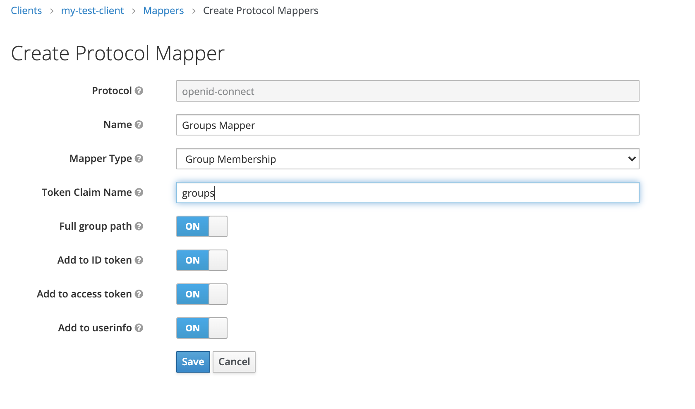

Let's also create a group and assign it to our `admin` user to view the effects. For that, click on `Groups` from the navigation. Click on `New`. 

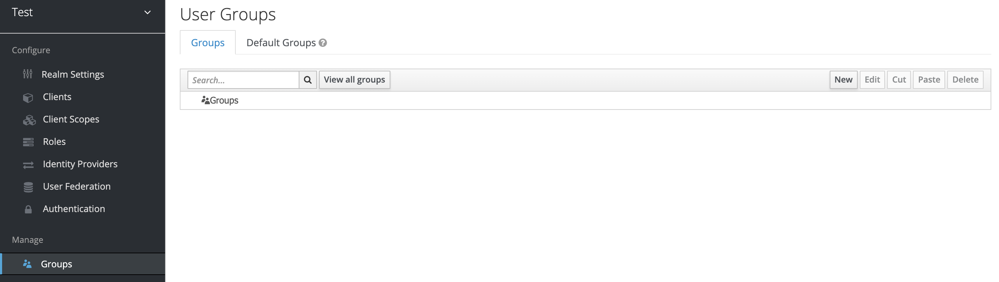

Provide a name for the new group and click on `Save`. I'm going to use `my-new-group`:

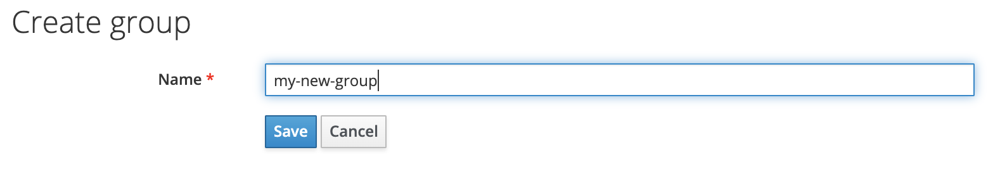

To add the `admin` user to this group, click on `Users` from the navigation, search for the `admin` user and open it's settings. Click on `Groups`. From the `Available Groups` list, click on the group we just created i.e. `my-new-group` and then click on `Join`: 

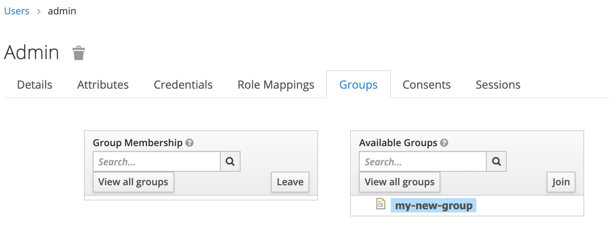

Now, if we regenerate the token, the payload would be something like this:

```
{
  "exp": 1596828991,
  "iat": 1596792991,
  "jti": "ea19a7ca-b72a-4b13-abc6-d0b8cc66db77",
  "iss": "http://localhost:8080/auth/realms/test",
  "aud": "account",
  "sub": "f33d74d4-a5ed-4da0-817c-503e75a81465",
  "typ": "Bearer",
  "azp": "my-test-client",
  "session_state": "65b34a44-2413-4db5-9daf-c870b2bed9c3",
  "acr": "1",
  "allowed-origins": [
    "/*"
  ],
  "realm_access": {
    "roles": [
      "offline_access",
      "uma_authorization"
    ]
  },
  "resource_access": {
    "my-test-client": {
      "roles": [
        "my-new-client-role"
      ]
    },
    "account": {
      "roles": [
        "manage-account",
        "manage-account-links",
        "view-profile"
      ]
    }
  },
  "scope": "email profile",
  "email_verified": false,
  "groups": [
    "my-new-group"
  ],
  "preferred_username": "admin"
}
```

As you can see, the groups that the user `admin` is part of now appear against a claim called `groups` in the token. Once a mapper is configured, your application can utilize the new claim in the token to implement group-based access control.

