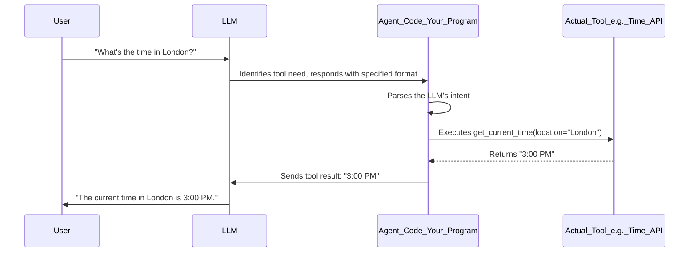
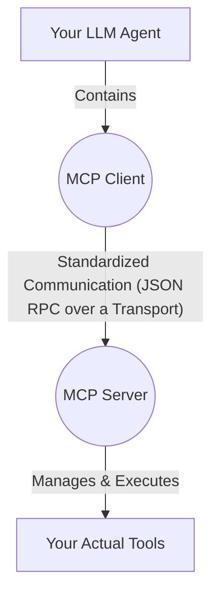
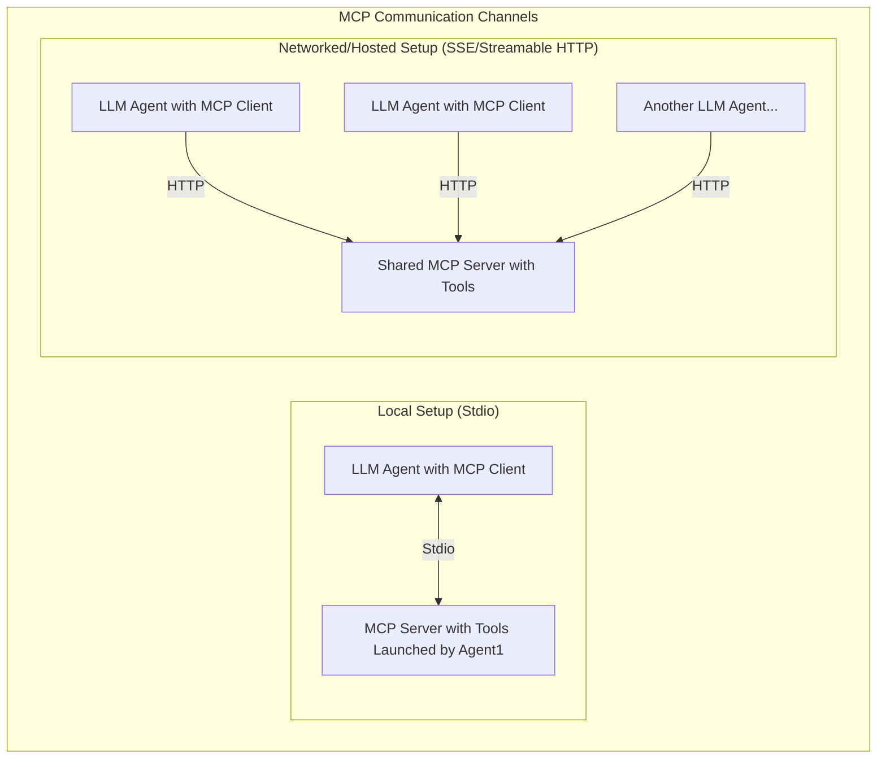

# LLM Tool Calling Series [Part 1]: Understanding Tool Calling and the Model Context Protocol (MCP)

So, unless you've been chilling under a particularly soundproof rock, you've probably heard that the new cool kid on the
block is hooking up your software and systems with Large Language Models (LLMs). Why? To give these AI brains the power
to not just chat, but to *do things* – understand your systems and take action when needed. This superpower has a
fitting name: **"Tool Calling."** And the software that lets an LLM actually use these tools? That's often called an **"
Agent."**

Think of it like giving your super-smart assistant (the LLM) a phone and a list of contacts (your tools) they can call
to get specific jobs done.

### The Lowdown: How Tool Calling Actually Works

Alright, let's peek under the hood. Tool calling isn't magic; it's a clever workflow.

1. **Teaching the LLM About Its Tools:** First, you've gotta let the LLM know what tools it has at its disposal. A
   common way to do this is to stuff a list of tool names, what each tool does (its description), and any information
   the tool needs to run (inputs) into the LLM's initial instructions – usually called the "system prompt."

2. **The LLM Doesn't *Actually* Call Anyone:** Here's a key thing: LLMs are fundamentally text-prediction machines.
   They're wizards at figuring out the next word in a sentence. They don't inherently know how to execute code or
   interact with external systems. So, we can't just tell an LLM "run `get_weather.exe`."

3. **Playing Pretend (Effectively!):** Instead, we instruct the LLM to respond in a *very specific format* whenever it
   thinks a tool should be used. It's like telling your assistant, "If you need to call someone, don't pick up the phone
   yourself. Just write down 'CALL: [Person's Name] about [Topic]' on this special notepad."

4. **The "Agent" Steps In:** This is where your "Agent" code comes into play. It constantly watches the LLM's responses.
    * It looks for that special format indicating a tool call.
    * It parses the LLM's "request" to figure out which tool and what inputs.
    * It *actually executes* the tool (e.g., calls the weather API).
    * It takes the tool's result (e.g., "75 degrees and sunny") and feeds it *back* to the LLM as new information.

5. **LLM Finishes the Job:** Now, with the tool's output, the LLM can formulate a human-friendly final answer.

Let's try a super-simplified example. Imagine this in the system prompt:

```
# Our imaginary instruction manual for the LLM
You're a helpful agent. If you need to use a tool, here's what you have:

Tool Name: get_current_time
Description: Use this to find out the current time for a specific city.
Input required:
- location (text format, e.g., "New York") (optional, if no location, assume user's current unknown location)

If you decide to call a tool, you MUST respond ONLY with the following format:
__TOOL_CALL_INTENT__: {"tool_name": "name_of_the_tool", "inputs": {"input_key_1": "value_1", "input_key_2": "value_2"}}
```

Now, if you ask the LLM: "Hey, what time is it in London?"

It might (if it's feeling helpful and understands our instructions) respond with:

```
__TOOL_CALL_INTENT__: {"tool_name": "get_current_time", "inputs": {"location": "London"}}
```

Your agent code sees `__TOOL_CALL_INTENT__`, grabs the JSON, calls your actual `get_current_time(location="London")`
function, gets back (say) "3:00 PM", and then tells the LLM: "Okay, the result of `get_current_time` for London was '3:
00 PM'."

The LLM then takes that and replies to you: "The current time in London is 3:00 PM."

Here's a simplified flow:



### Growing Pains: Everyone Doing Their Own Thing

As you can imagine, this tool-calling capability is gold. So, most major LLM providers (like OpenAI, Google, Anthropic,
etc.) started offering ways to make this easier. You can see a good list of who supports what on
the [Langchain chat model feature matrix](https://python.langchain.com/docs/integrations/chat/) (look for "Tool Calling"
or "Function Calling").

For instance, OpenAI initially enabled this through "structured outputs" and then refined it into a more explicit "
function calling" feature. This was awesome, but it led to a bit of a Wild West situation. Each LLM provider had its own
unique way of defining tools and signaling tool calls.

This lack of a standard was a headache:

* **No Easy Swapping:** If you built an agent with LLM 'A', and your buddy built one with LLM 'B', you couldn't easily
  mix and match or switch LLM providers without a bunch of rewriting. It was like everyone inventing their own type of
  phone charger before USB-C came along.
* **Tool Silos:** Your amazing `get_weather` tool built for one LLM's agent wouldn't magically work with another.

This is where Anthropic (the folks behind the Claude LLM) stepped in with a cool idea: the **Model Context Protocol (
MCP)**.

### Enter MCP: A Universal Translator for LLM Tools

The [Model Context Protocol (MCP)](https://www.anthropic.com/news/model-context-protocol) aims to bring some order to
the chaos. It's like creating that universal USB-C standard, but for LLM tools.

MCP cleverly splits the tool-calling job into two main parts:

1. **MCP Server:** This is where your actual tools live. It's a program that knows how to execute your
   `get_current_time` function, your `send_email` function, or any other custom action.
2. **MCP Client:** This bit lives within your LLM agent. When the LLM decides it wants to use a tool, the MCP Client
   takes that intent and talks to the MCP Server.

**How do they talk?** They use **JSON RPC**. Fancy name, simple idea: it's a standardized way for programs to send
messages to each other using JSON (a human-readable text format for data). The client sends a JSON message saying, "Hey,
run the 'get_current_time' tool with 'London' as the location," and the server sends a JSON message back with the
result.



The beauty is, as long as both the client and server agree on this JSON RPC format, the actual "how" they send these
messages (the transport layer) can vary. MCP standardizes three ways for them to chat:

* **Stdio (Standard Input/Output):**
    * **What it is:** Imagine the MCP client *starts* the MCP server program on the same computer. They then talk to
      each other using the basic text input/output streams that all programs have.
    * **Best for:** Simple setups where your agent and its tools run on the same machine. It’s a 1:1 relationship: one
      client, one server it directly controls.
    * **Analogy:** Like two programs on your laptop whispering directly to each other.

* **Server-Side Events (SSE):**
    * **What it is:** This is an HTTP-based method. Your MCP client sends a request (usually an HTTP POST) to a running
      MCP server (which could be anywhere on a network). The server then "streams" responses back using a special format
      called `text/event-stream`.
    * **Best for:** Hosted MCP servers that many different clients might want to connect to. The server can push updates
      to the client without the client constantly asking.
    * **Analogy:** Like subscribing to a news feed; the server sends you updates as they happen.

* **Streamable HTTP:**
    * **What it is:** A more modern alternative to SSE, offering similar capabilities but often more efficiently. It
      uses techniques like "chunked transfer encoding" or HTTP/2 streams to send data back from the server.
    * **Best for:** Similar to SSE – hosted servers, multiple clients – but potentially with better performance or more
      flexibility for complex data streaming.
    * **Analogy:** A more advanced, efficient version of that news feed subscription.

The last two (SSE and Streamable HTTP) are perfect for when you want to set up a central "tool hub" (your MCP server)
that multiple LLM agents (your MCP clients) can tap into.



### The "Aha!" Moment: Tool Discovery

One of the slickest parts of MCP is **tool discovery**. An MCP server can tell any connecting client exactly what tools
it offers, what those tools do (their descriptions), and what inputs they need. You can check out the specifics on how
they [list tools in the spec](https://modelcontextprotocol.io/specification/2025-03-26/server/tools#listing-tools).

**Why is this a game-changer?** Remember how we had to manually write down the tool info in the LLM's system prompt?
With MCP discovery, the MCP client can just *ask* the MCP server: "Hey, what can you do?" The server responds with a
neat list, and the client can then automatically format this information and feed it straight into the LLM's system
prompt!

This is precisely how libraries like Langchain, through adapters such as
`langchain-mcp-adapters` ([check their GitHub](https://github.com/langchain-ai/langchain-mcp-adapters)), can make
building agents so much smoother. They handle the discovery and plumbing for you.

### So, What's the Big Deal with MCP?

MCP is trying to make life easier for everyone building with LLMs and tools:

* **Interoperability:** Build a tool server once, and potentially have agents using different LLMs (as long as they have
  an MCP client) talk to it.
* **Modularity:** Separate your tool logic (in the MCP server) from your LLM agent logic. This makes things cleaner and
  easier to manage.
* **Reusability:** That awesome tool set you built can be used by multiple agents or applications without reinventing
  the wheel.
* **Standardization:** It paves the way for a more mature ecosystem where tools and agents can plug and play more
  nicely.

It's still relatively new, but the idea of a common ground for LLM tool calling is a big step forward, making the dream
of truly capable and versatile LLM agents much more attainable.
